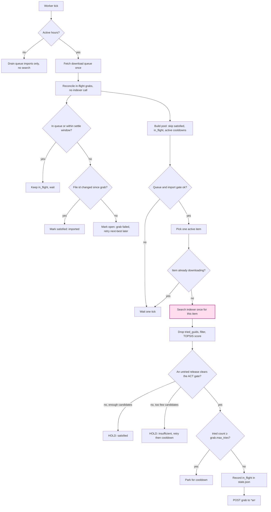
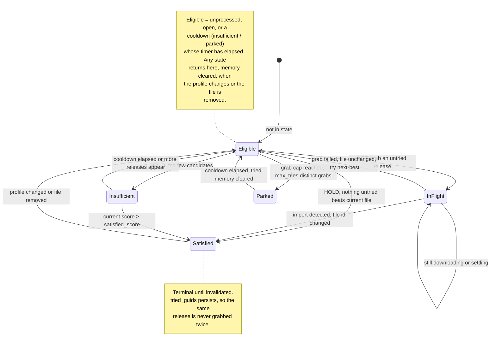

# How Optimizarr decides

This is the in-depth companion to the [README](README.md): the selection algorithm, the
configuration model, and the worker loop.

The optimizer evaluates the releases available for one library item, decides whether a better one
exists, and grabs it through Radarr/Sonarr. It is built around the reality that **grabbed releases
frequently fail to download**, so *"optimized"* means *the algorithm can no longer find anything
better than the current file*, never merely *"we triggered a grab."*

Three ideas carry the whole design:

- **Two relative axes.** Each candidate is scored on just two axes — Profilarr **score** (higher
  better) and **GiB/h** (smaller better) — each min-max normalized *over the candidates the
  indexers actually returned for this movie*. There are no absolute size bands, target sizes, or
  shaped curves; "good size" is defined relative to what is on offer, which is what lets one
  profile shrink a movie that another leaves alone.
- **The forbidden quadrant.** Versus the current file a pick may be better+bigger (a real score
  upgrade), better+smaller (ideal), or a little worse+smaller (a deliberate size trade). It may
  **never** be worse *and* bigger. That falls out for free: a candidate worse on both axes must
  improve by at least one concrete threshold (`min_score_delta` or `min_size_delta_gb`) to ACT,
  which a worse+bigger candidate never can.
- **One-and-done, and never the same release twice.** A movie is optimized once: when its current
  (imported) file is the best pick for its profile it is marked *satisfied* and never re-evaluated.
  Every release ever grabbed for a movie is remembered (`tried_guids`) and never grabbed again, so
  the optimizer cannot oscillate even when a release's score does not survive import (see
  [§5](#5-the-worker-loop-and-state)).

---

## 1. Inclusion filters

Before scoring, candidates pass through filters that drop the obviously-bad. They are identical for
every profile (`topsis.py::apply_prefilters`):

1. **Hard rejections** — blocklisted, unparseable, wrong item, dead torrents, temporarily-rejected.
2. **Score window** — three-tier, anchored at the top of what the indexers offer (favors quality,
   only widens when the indexer is sparse). Negatives are always dropped (all floors are ≥ 0).
   - *Tier 1* `score >= max_available − score_window`. If ≥ `min_candidates` survive: accepted.
   - *Tier 2* `score >= current_file_score`. Expands to include releases at or above what you
     already have. Tried when Tier 1 yields too few.
   - *Tier 3* `score >= max(0, current_file_score − score_window)`. The full downgrade budget:
     allows trading some score for a meaningfully smaller file. Reached only as a last resort.
3. **Resolution** — keep only the profile's **target resolution**, so the GiB/h axis is comparable
   (a 1080p and a 2160p release are not). This also enforces "never drop below target".
4. **Legitimacy band** — drop anything outside the shared per-resolution `[floor, ceiling]` GiB/h
   bounds (fake/upscale below floor, bloat above ceiling). These are wide (≈ P1 / P99 of real
   sizes); the relative scoring, not a hard band, expresses taste.
5. **Outlier drop** *(`outlier_frac` = 0.5)* — drop a release whose GiB/h is below
   `outlier_frac × median(survivors)`. This is the key guard against over-compressed / upscale
   "2160p" junk that Profilarr still scores high on format tags (a real 2160p HEVC is ~4-8 GiB/h;
   junk is < 2). Without it, ~half of picks were such tiny files. The absolute floor is too low to
   catch them; this relative check is what does.

If fewer than `min_candidates` (default 6) survive all filters, the relative min-max is not
trustworthy, so the decision is **HOLD as insufficient**: the movie is not satisfied or excluded,
just retried on later passes (see the retry/cooldown handling below). `min_candidates` also controls
when the score-window tier is accepted vs expanded.

**Insufficient-candidate retry/cooldown.** An insufficient HOLD is counted in `state.json`. While
the count is below `optimizer.retry.max_tries` (default 3) the item stays active and is retried each
pass; once it exhausts its tries it is rested for `optimizer.retry.cooldown_days` (default 30), then
re-evaluated fresh (the counter resets). The one exception: if the current file already scores at
least `optimizer.retry.satisfied_score` (default 800000) it is good enough on its own, so the item
is marked **satisfied** immediately instead of being retried.

---

## 2. Relative scoring

Over the survivors, each axis is min-max normalized (the current file is then placed on the same
ranges, clamped, so it is comparable):

```
n_score = (score − min_score) / (max_score − min_score)          # higher score -> 1
n_size  = (max_gbh − gbh)     / (max_gbh − min_gbh)              # smaller file -> 1
```

A degenerate range (all equal) yields 1.0 for that axis (it does not discriminate). A profile's
**weights** (score + size, summing to 1.0) combine the two into a TOPSIS *closeness* — distance to
the ideal point `(1, 1)` vs the anti-ideal `(0, 0)`:

```
d_ideal = √( w_score·(1−n_score)² + w_size·(1−n_size)² )
d_anti  = √( w_score·n_score²     + w_size·n_size²     )
closeness = d_anti / (d_ideal + d_anti)        # 1 = ideal, 0 = anti-ideal
```

The weights are the **only** per-profile knob. The shipped profiles:

| Profile | score | size | leans |
| --- | --- | --- | --- |
| Remux | 0.94 | 0.06 | best score, size barely matters |
| Quality | 0.86 | 0.14 | best score, mild lean to smaller |
| Balanced | 0.56 | 0.44 | middle |
| Efficient | 0.44 | 0.56 | smaller, decent score |
| Compact | 0.22 | 0.78 | smallest legitimate file |

Because the axes are relative, the smallest survivor always gets `n_size = 1` regardless of its
absolute bitrate — so Efficient/Compact pick the lean release even when every candidate sits in
what a fixed band would call "too big". Resolution is **not** a scored axis (Profilarr folds it
into the score, and filter 3 already pins it).

---

## 3. The decision

`decision.py::decide`: resolve the profile → drop already-tried releases → run the filters →
relatively score the survivors → compare to the current file.

- **Tried releases are dropped first.** Any release whose `guid` is in the movie's `tried_guids`
  (everything ever grabbed for it) is removed before scoring, so the same release is never grabbed
  twice. If the only releases that would beat the current file are tried ones, nothing untried
  clears the gate and the movie is satisfied (the anti-oscillation give-up).
- ACT on the best candidate (highest TOPSIS closeness) **iff** it clears at least one concrete
  threshold vs the current file: score improves by `>= min_score_delta` (default `100`) **or**
  size shrinks by `>= min_size_delta_gb` (default `0.5 GB`). When there is no current file, any
  candidate qualifies. Two optional per-app pre-filters run first: `allow_size_increase = false`
  drops anything bigger than the current file, `allow_quality_downgrade = false` drops anything
  lower-scoring.
- Otherwise **HOLD**. Two kinds:
  - **satisfiable** — there were enough candidates and none cleared either threshold: the current
    file is good enough for its profile, so mark it satisfied (permanent). Also reached when there
    are too few candidates but the current file already scores `>= retry.satisfied_score`.
  - **insufficient** — fewer than `min_candidates` and the current file is below
    `retry.satisfied_score`: do *not* satisfy; count a retry attempt and, after `retry.max_tries`,
    rest the item for `retry.cooldown_days` before re-evaluating it fresh.

The forbidden quadrant is impossible: a candidate worse on both axes (lower score, bigger size)
cannot clear either threshold and therefore never triggers ACT.

---

## 4. Configuration model

Everything lives under `[optimizer.topsis]`, layered on `defaults.toml`:

```toml
[optimizer.topsis]
score_window = 100000          # downgrade budget: keep score >= current - this
min_candidates = 2             # below this, HOLD without satisfying
outlier_frac = 0.5             # drop releases below 0.5x the movie's median GiB/h (junk guard)
default_preset = "Balanced"    # used when a profile name matches no preset keyword
min_score_delta = 100          # ACT only if pick.score - current.score >= this
min_size_delta_gb = 0.5        # ...or if current.size - pick.size >= this (in GB)

[optimizer.topsis.size_bounds]  # shared per-resolution {floor, ceiling} GiB/h legitimacy band
"2160" = { floor = 3.0, ceiling = 30.0 }
"1080" = { floor = 1.0, ceiling = 15.0 }
# … 720 / 480 …

[optimizer.topsis.presets.Efficient]
score = 0.40                   # weights (score + size, sum 1.0) — the only per-profile knob
size = 0.60

[optimizer.retry]              # insufficient-candidate retry/cooldown handling
max_tries = 3                  # too-few-candidate attempts before resting the item
cooldown_days = 30             # days to leave an exhausted item alone before re-evaluating it
satisfied_score = 800000       # current-file score that satisfies despite too few candidates

[optimizer.grab]               # grab lifecycle / anti-oscillation
max_tries = 10                 # distinct releases to grab for one item before parking (cooldown_days)
settle_minutes = 10            # wait this long AND for the item to leave the queue before resolving
```

A profile attaches to the preset whose name is a case-insensitive substring of the profile name
(`2160p Efficient` → Efficient); `[optimizer.topsis.profiles."Exact Name"]` overrides a preset
or its weights for one profile.

---

## 5. The worker loop and state

The optimizer is a continuous, interval-driven worker. Each tick it reconciles any finished grabs,
refreshes the item list if due, gates on the download queue, then evaluates at most one item. The
flowchart below traces a single tick; the one place it ever calls the indexer is the highlighted
`Search indexer` box, which is only reached for an item that is active, not already downloading, and
not awaiting a grab.



### Per-item state lifecycle

`state.json` (keyed by item id) records, per item, the **profile** it pertains to and
**`tried_guids`** (every release ever grabbed for it; never grabbed again). In-flight entries also
store the grabbed release, grab time, and the file id at grab time; insufficient entries store the
retry count and cooldown end. Every grab IS recorded (status `in_flight`), persisted *before* the
grab is posted so a crash can never double-grab.



- **In-flight resolution needs no indexer call.** When a grabbed item has left the download queue
  and its settle window has passed, the worker compares the item's current file id to the one saved
  at grab time: changed → the grab **imported** → satisfied; unchanged → it **failed** → open, and
  the next-best untried release is tried next pass (the failed one is blocklisted by Radarr/Sonarr
  **Failed Download Handling** *and* now in `tried_guids`). The settle window guards the gap between
  the grab and its appearance in the queue, so a fresh grab is never declared failed too early.
- **Never the same release twice.** Because every grab is remembered, the optimizer cannot loop on a
  release whose search-time score does not survive import (the classic re-grab trap): it grabs that
  release at most once, then either the import satisfies it or it moves on, giving up (satisfied)
  when only tried releases would beat the file.
- Satisfied is **permanent**: no time-based re-evaluation; eligible again only if the **profile
  changes** or the **file is removed**. Insufficient and parked are **transient** cooldowns. A
  profile change or removed file re-opens any state immediately and clears its grab memory.
- **Restart-safe.** All writes are atomic and lock-guarded, and in-flight grabs are re-derived from
  the live queue + file id on the next tick, so a restart mid-download neither re-grabs nor loses
  track of what was already grabbed.

### Why it cannot loop again (termination analysis)

Every cycle in the graph is bounded, so no item can be grabbed or searched without end:

- **A release is grabbed at most once per item.** Its `guid` enters `tried_guids` before the grab
  and is filtered out forever after, so the search-vs-import score trap (a release that always looks
  like an upgrade over the file it produced) can fire only once, not every cycle.
- **In-flight always resolves.** An item with an outstanding grab is excluded from evaluation and is
  resolved purely from the queue plus file id, so it never triggers a search while downloading and
  always lands on satisfied (imported) or open (failed).
- **The grab budget is finite.** Repeated failures walk through distinct releases until one imports,
  the pool is exhausted (→ satisfied), or `grab.max_tries` is hit (→ parked for a cooldown). At most
  `max_tries` grabs per item per cooldown window.
- **Cooldowns are time-bounded.** Insufficient and parked items are inactive until their
  `retry_after`, then re-evaluated fresh, capping how often a hard-to-place item is retried.

The one residual stuck-state is a download that never leaves the queue (e.g. an `importBlocked` item
needing manual action): the item simply stays `in_flight` and paused. That is safe (it never
re-grabs and never searches), but it also never progresses on its own, so a permanently stuck queue
item is the one case worth watching in the logs.

### Active-hours schedule

`[optimizer.schedule]` defines a per-day active window in local time (24h HH:MM). **Outside the
window the worker skips list refresh and movie evaluation, but queue import processing always
runs** (so completed downloads kept off the queue by auto-import are never blocked by the
schedule).

A window where `start >= end` crosses midnight. The default ships `23:00` to `08:00` on every day,
meaning the optimizer queries indexers and evaluates movies overnight. Omit a day (or the entire
block) to treat that day as always active. Transitions are logged once at INFO.

---

## 6. The Unmonitor job

A separate, cron-scheduled pass (`[unmonitor]`, default `0 4 * * *`) that **unmonitors** items so
the \*arr apps stop chasing upgrades off their RSS feeds. An item is unmonitored when it is
monitored, has a file, (optionally) has its quality cutoff met, and is at least `days` old against
the configured `release_type` date. This pairs with the optimizer: the optimizer keeps improving
files by `hasFile` regardless of monitored state, while Unmonitor strips the monitoring that would
otherwise have Radarr/Sonarr fighting it with fresh RSS grabs.

---

*`dry_run = true` makes both features log every would-be action without changing anything.
`tools/diagnose.py` runs the real engine over a gathered library sample
(`tools/gather_training_data.py`) and reports the pick quadrants, the total size shift, and the
full original → new-pick list.*
