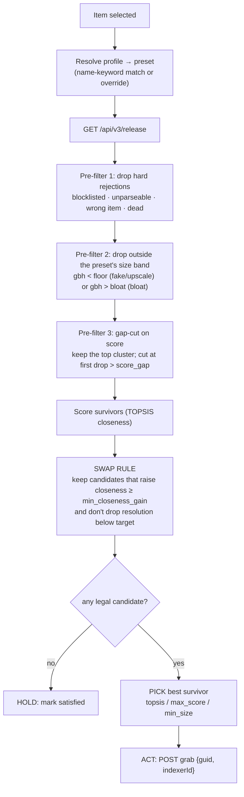
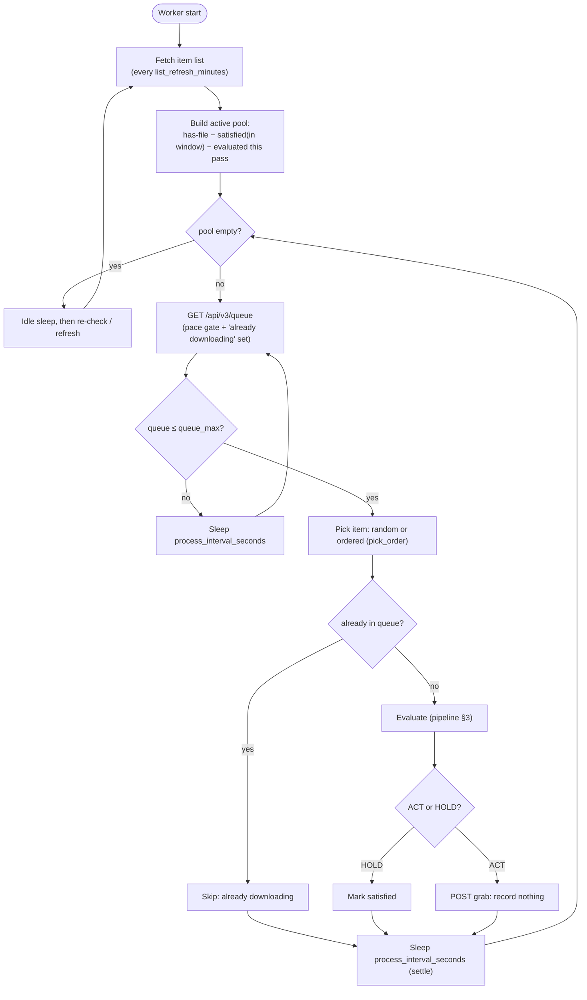
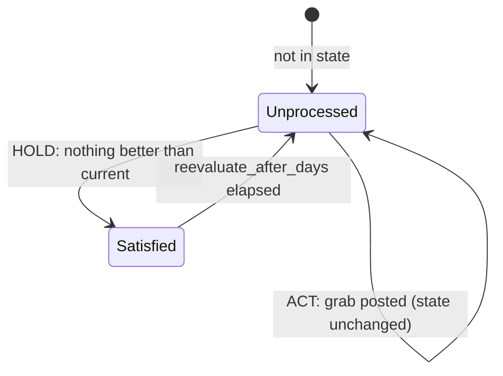

# How Optimizarr decides

This is the in-depth companion to the [README](README.md): the selection algorithm, the guard
rails, the TOPSIS math, the configuration model, and the worker loop.

The optimizer evaluates the releases available for one library item, decides whether a better
one exists, and grabs it through Radarr/Sonarr. It is built around the reality that **grabbed
releases frequently fail to download**, so *"optimized"* means *the algorithm can no longer find
anything better than the current file*, never merely *"we triggered a grab."*

There are two big ideas:

- **Per-preset absolute size tables.** Each preset carries its own `{floor, target, bloat}` band
  per resolution (GiB/h). `floor` and `bloat` are hard gates (out-of-band releases are dropped
  before scoring); `target` is where the size score plateaus. The curve is **one-sided**, so a
  file is never inflated to "reach" a target.
- **A single closeness-gain swap rule.** Releases are scored by TOPSIS *closeness* (a number
  derived from the release alone), and a candidate is grabbed only if it raises closeness past a
  small margin, plus a resolution guard. Because closeness is file-independent and strictly
  increases on every swap, the optimizer **cannot oscillate**, for cycles of any length.

---

## 1. The size model: per-preset tables, one-sided curve

Each preset defines its own `[optimizer.topsis.presets.<name>.reference]` table: one
`{floor, target, bloat}` entry per resolution, in GiB/h (`GB = 1024³`, so GiB). The shipped
tables (floor / target / bloat):

| preset | 2160 | 1080 | 720 | 480 |
| --- | --- | --- | --- | --- |
| Remux | 15 / 35 / 80 | 8 / 18 / 40 | 2 / 5 / 12 | 0.5 / 1.5 / 4 |
| Quality | 5 / 11 / 20 | 1.5 / 5 / 10 | 0.5 / 2 / 5 | 0.25 / 0.8 / 3 |
| Balanced | 4.5 / 9 / 16 | 1.5 / 3.8 / 8 | 0.5 / 1.5 / 4 | 0.2 / 0.6 / 2.5 |
| Efficient | 3.5 / 6.5 / 14 | 1 / 2.6 / 7 | 0.4 / 1 / 3.5 | 0.2 / 0.45 / 2 |
| Compact | 3 / 5 / 12 | 1 / 2 / 6 | 0.35 / 0.8 / 3 | 0.2 / 0.35 / 2 |

- **floor**: below this a release is illegitimate for the resolution (an upscale, a mislabeled
  lower resolution, or an encode too soft to deliver it). Dropped before scoring.
- **target**: where the size score plateaus. A *good* release for this preset sits here or below.
- **bloat**: above this is bloat. Dropped before scoring, and size desirability is 0 at `bloat`.

The size-desirability curve is **one-sided**:

```
n_size(gbh) = 1.0                          if gbh ≤ target        (plateau, smaller never punished)
            = (bloat − gbh)/(bloat − target)   if target < gbh < bloat   (linear ramp down)
            = 0.0                          if gbh ≥ bloat
```

Two consequences make this safe for a space-saving tool:

- **Nothing is ever inflated.** A file already at or below `target` scores `n_size = 1.0`, so
  TOPSIS has no reason to swap it for a bigger one. A tiny, good-scoring file stays.
- **Among files at/below `target`, size ties at 1.0, so score breaks the tie**, i.e. "small
  enough, then best score," which is exactly "good *and* small."

Tables differ by taste: size-leaning presets (Efficient, Compact) sit low, so they admit and aim
at lean encodes; Remux sits at remux bitrates, so its floor rejects ordinary encodes.

---

## 2. Scoring: TOPSIS over three axes

Each surviving release is described by three attributes, all normalized to `[0, 1]`:

```
n_score      = clamp( (score − score_anti_ideal) / (score_ideal − score_anti_ideal), 0, 1 )
n_resolution = clamp( (height − res_anti_ideal)  / (target_height − res_anti_ideal),  0, 1 )
n_size       = one-sided curve above (uses the preset's target + bloat for this resolution)
```

Score normalizes on a **fixed** scale (`[0, 1,000,000]` by default) so good releases stay
comparable across items. Resolution climbs toward the profile's target height (low weight on
purpose, since Profilarr already folds resolution into the score, so this axis mostly avoids
double-counting).

A profile's **weights** (summing to 1.0) combine the axes into a TOPSIS *closeness*, the distance
to the ideal point `(1,1,1)` vs the anti-ideal `(0,0,0)`:

```
d_ideal = √( Σ wₖ·(1 − aₖ)² )
d_anti  = √( Σ wₖ·aₖ² )
closeness = d_anti / (d_ideal + d_anti)        # 1 = ideal, 0 = anti-ideal
```

Shipped weights and pick method:

| Profile | score | resolution | size | pick method |
| --- | --- | --- | --- | --- |
| Remux | 0.80 | 0.15 | 0.05 | `max_score` |
| Quality | 0.65 | 0.15 | 0.20 | `topsis` |
| Balanced | 0.50 | 0.10 | 0.40 | `topsis` |
| Efficient | 0.40 | 0.10 | 0.50 | `topsis` |
| Compact | 0.20 | 0.10 | 0.70 | `min_size` |

`max_score` (Remux) and `min_size` (Compact) are deterministic single-axis picks among the legal
candidates; the middle three blend score vs size, which is what TOPSIS is for.

---

## 3. The decision pipeline



Two app-policy pre-filters can run before scoring: `allow_size_increase = false` drops anything
bigger than the current file, and `allow_quality_downgrade = false` drops anything lower-scoring
(turning the latter off neutralizes the size-leaning profiles, which is the point of the flag).

ACT if at least one candidate passes the swap rule, else HOLD. Closeness decides both *whether*
to act (the gain margin) and, via the pick method, *which* survivor to grab.

---

## 4. The swap rule (the guard rails)

A scored candidate may replace the current file only if **both** hold:

1. **Closeness gain.** `closeness(candidate) ≥ closeness(current) + min_closeness_gain`. Closeness
   is computed from the release's own attributes and the preset (not from the current file), so it
   is a single, stable per-release number. `min_closeness_gain` (default `0.02`, per-preset
   overridable) is a hysteresis margin that avoids churning for negligible gains. An unknown
   current score is treated as the worst case, so any scored candidate is an improvement.
2. **Resolution guard.** `min(cand_res, target) ≥ min(cur_res, target)`, where `target` is the
   profile's target resolution. Resolution may rise toward the target or fall only as far as the
   target, never below it. This preserves "drop resolution to match a leaner profile" (a 1080p
   profile may move a 2160p file down to 1080p) while stopping a size-leaning preset from shaving
   resolution below what the profile asks for.

### Why there is no explicit "no senseless swap" rule

"Never swap to a bigger file for a lower (or equal) score" is **not** a separate rule: at equal
resolution such a candidate is worse on score and no better on size, so its closeness cannot
exceed the current file's, and the gain test already rejects it. The resolution guard is the only
hard constraint closeness does not already imply (a size-leaning preset could otherwise raise
closeness by dropping resolution for size).

### No oscillation, for any cycle length

Closeness is a pure function of a release's attributes and the preset, independent of which file
you currently hold. Every accepted swap raises the held file's closeness by at least
`min_closeness_gain`, so that closeness is **strictly increasing** and bounded by 1: the walk
visits each file at most once and terminates in at most `1 / min_closeness_gain` swaps. This is a
stronger guarantee than a pairwise rule can give. Two directional size/score thresholds, for
example, can stop a 2-file ping-pong yet still admit a 3-file cycle; a single monotonic quantity
cannot cycle at all. The convergence property is checked in tests by simulating the
grab/re-evaluate loop over thousands of random pools across every preset.

---

## 5. Configuration model

Everything lives under `[optimizer.topsis]`, layered on `defaults.toml`:

```toml
[optimizer.topsis]
score_ideal = 1000000          # n_score scale …
score_anti_ideal = 0
resolution_ideal = 2160        # fallback target when a profile exposes no allowed resolution
resolution_anti_ideal = 480
score_gap = 0.20               # gap-cut: keep the top score cluster within this relative drop
default_preset = "Balanced"    # used when a profile name matches no preset keyword
min_closeness_gain = 0.02      # global swap margin (per-preset overridable)

[optimizer.topsis.presets.Efficient]
score = 0.40                   # weights (sum 1.0)
resolution = 0.10
size = 0.50
pick = "topsis"                # topsis | max_score | min_size
min_closeness_gain = 0.02      # optional per-preset override
[optimizer.topsis.presets.Efficient.reference]
"2160" = { floor = 3.5, target = 6.5, bloat = 14 }   # GiB/h per resolution
"1080" = { floor = 1.0, target = 2.6, bloat = 7 }
# … 720 / 480 …
```

A Radarr/Sonarr profile attaches to the preset whose name is a case-insensitive **substring** of
the profile name (`2160p Quality` → Quality). Pin or customize an exact profile with
`[optimizer.topsis.profiles."<name>"]`, which may set `preset`, `weights`, `pick`, `reference`, or
`min_closeness_gain` (anything omitted is inherited from the matched preset). Validation at load
time enforces weights-sum-to-1, `0 ≤ min_closeness_gain < 1`, `floor < target ≤ bloat`, and a
known `pick` method.

---

## 6. The worker loop

The optimizer is a continuous, interval-driven worker (the unmonitor job keeps its own cron).



- **One queue fetch per iteration** serves both the pace gate (`queue_max`) and the "already
  downloading?" skip, so there's **no in-flight state** to track and a restart needs no
  reconciliation.
- `process_interval_seconds` (default 15, min 10) doubles as a **settle delay**: after a grab,
  Radarr needs a moment to register the release in the queue before the next `queue_max` check.
- `pick_order` only changes which items are improved first (random, or ordered by title / file
  size / date added / release date), never the per-item decision.
- A grab **records nothing**. Each item is remembered for the current **pass** so it isn't
  re-picked; a list refresh updates the candidate set but doesn't restart the pass. When the pass
  is fully covered it resets.

### Per-item state lifecycle

State (`/data/state.json`, keyed by item id) records exactly one thing, whether an item is
**satisfied**, which is what makes failure handling self-correcting.



- A grab is **never recorded**. A grab that **succeeds** replaces the file; next evaluation finds
  nothing better → **satisfied** → leaves the pool. A grab that **fails** was never satisfied, so
  the item is retried, and by then the dead release is blocklisted, so pre-filter 1 drops it and
  the next-best candidate is picked. Repeated failures walk down the ranking until one sticks.
- A download **in progress** is skipped via live queue membership, never re-grabbed.

> **Dependency:** this relies on Radarr/Sonarr **Failed Download Handling** (default on) to
> blocklist dead releases. Without it, a failed grab wouldn't be de-prioritized next pass.

---

## 7. The Unmonitor job

A separate, cron-scheduled pass (`[unmonitor]`, default `0 4 * * *`) that **unmonitors** items so
the \*arr apps stop chasing upgrades off their RSS feeds just because newer releases appeared.

An item is unmonitored when **all** of these hold (`features/unmonitor/candidates.py`):

1. it is currently **monitored** (otherwise nothing to do);
2. it **has a file**: never unmonitor a wanted-but-undownloaded item (that would mean "give
   up"); only stop chasing *upgrades*;
3. if `require_cutoff_met = true`, its quality **cutoff is met** (don't stop early if it hasn't
   reached the target quality yet);
4. it is at least `days` old, measured against the configured `release_type` date
   (`digitalRelease` for Radarr, `airDateUtc` for Sonarr, by default).

This pairs naturally with the optimizer: the optimizer keeps improving files by `hasFile`
regardless of monitored state, while Unmonitor strips the monitoring that would otherwise have
Radarr/Sonarr fighting it with fresh RSS grabs.

---

*`dry_run = true` makes both features log every would-be action without changing anything.
`tools/weight_lab.py` renders how each preset scores and picks across sample releases, and
`tools/weight_lab.py --dataset <jsonl>` runs the presets against a real gathered library sample
(see `tools/gather_training_data.py`).*
